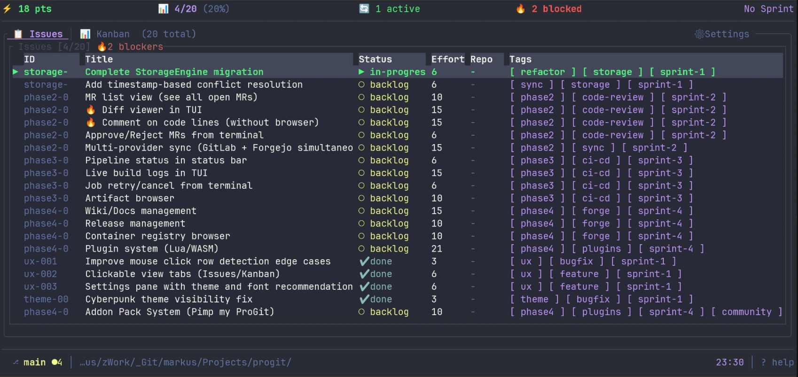
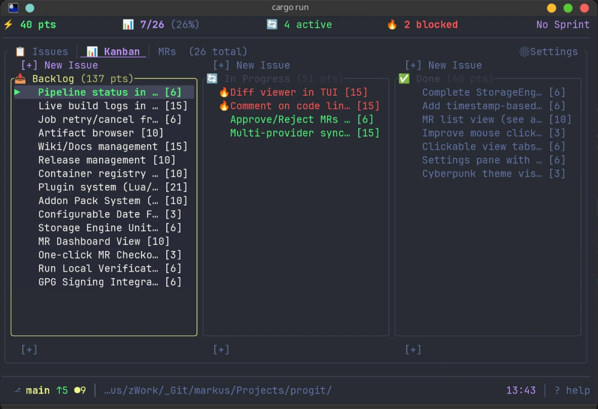
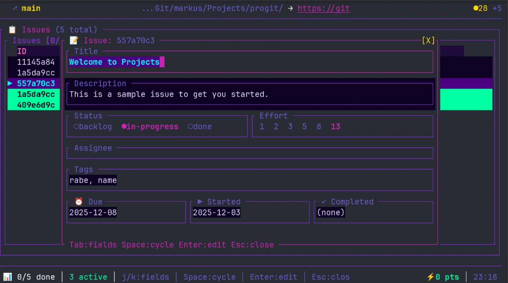

# ProGit

**A terminal-native project tracker. 6.5 MB binary. Your data, in your repo.**

[](LICENSE)
[](CHANGELOG.md)
[](https://www.rust-lang.org)

> *"I replaced GitLab with a 6.5 MB binary."*

---

## What is ProGit?

ProGit is a **terminal-native project tracker** — issues, kanban boards, merge requests, code review, conflict resolution, and AI-assisted workflows — all inside a single `prog` binary that starts in under 100ms and stores everything as plain files in your repository.

No cloud. No database. No browser. Your issues are JSON. Your config is KDL. Your data never leaves your machine unless you want it to.

**The pitch:** Issues in your repo, not in someone else's database. Fast enough that you never open the browser. Small enough to `curl | sh` in 10 seconds.

---

## Screenshots

| List View | Kanban View | Detail View |
|-----------|-------------|-------------|
|  |  |  |

---

## Install

### One-line installer (Linux/macOS)

```bash
curl -fsSL https://progit.sovereign-society.org/install.sh | sh
```

Installs the released binary as `~/bin/prog`. Verifies minisign signature when
`minisign` is available.

### Homebrew (macOS/Linux)

```bash
brew install sovereign-society/tap/progit
```

### Arch Linux (AUR)

```bash
paru -S progit-bin
# or
yay -S progit-bin
```

### From source

```bash
git clone https://git.sovereign-society.org/ProGit/progit
cd progit
cargo build --release
./scripts/link-user-bin.sh target/release/prog
```

The source-build path links the built binary to `~/bin/prog`. Do not rely on
`/usr/local/bin/prog`; stale global binaries can hide the current release.

### Verify

```bash
prog --version
prog --help
```

---

## Quick Start

```bash
cd your-project/
prog init      # creates .project/ with config and issue storage
prog           # launches the TUI
```

**Keyboard-first workflow:**
- `Tab` — switch views (Issues → Kanban → MRs → Dashboard)
- `j/k` — navigate
- `Enter` — open detail
- `n` — new issue
- `Space` — toggle status
- `Ctrl+P` — fuzzy palette (jump to any issue, file, or commit)
- `?` — help
- `q` — quit

---

## Features

### Issue Tracking

Issues stored as JSON in `.project/issues/`. Create, edit, assign, label, track time — all from the terminal. Full offline support. Sync bidirectionally with Forgejo and GitLab when ready.

### Kanban Board

Visual card-based workflow. Drag issues between columns with keyboard shortcuts. Color-coded priorities, assignees, and labels. Faster than any web kanban because there's zero render latency.

### Merge Requests & Code Review

Browse open MRs, read diffs, leave line-level comments — all inside the TUI. CI/CD pipeline status shown inline (✓ passed, ✗ failed, ● running).

### Fuzzy Command Palette (`Ctrl+P`)

Jump to any issue, file, commit, or action in under 200ms. The one feature that makes going back to the browser feel like using dial-up.

### Interactive Rebase

Visual, keyboard-driven rebase. Pick, squash, reorder, edit — in under 5 seconds for complex rebases. No `GIT_SEQUENCE_EDITOR` hacks.

### AI Agent (Ollama)

Seven built-in actions powered by local Ollama:

| Action | What it does |
|--------|-------------|
| Explain Changes | Code review assistant |
| Generate Tests | Unit test scaffolding |
| Refactor Code | Structure improvements |
| Add Documentation | Docstring generation |
| Find Bugs | Static analysis |
| Optimize Performance | Algorithm suggestions |
| Generate Commit Message | Conventional Commits |

Runs entirely local. No API keys, no cloud, no data leaving your machine.

### Plugin System (LuaJIT)

Extend ProGit with Lua plugins. The plugin SDK is Apache-2.0 licensed and runtime-loaded — the TUI never depends on plugin internals.

```lua
-- my-plugin.lua
local plugin = {
    metadata = { name = "my-plugin", version = "1.0.0" }
}
function plugin:on_event(event)
    if event.type == "IssueCreated" then
        print("New issue: " .. event.data.issue_id)
    end
end
return plugin
```

Install plugins: `prog plugin install <name>`

### Forge Sync

Bidirectional sync with Forgejo and GitLab. Issues, labels, milestones — kept in sync on your schedule. GitHub sync coming in a future release.

### Themes

Cyberpunk, Nord, Dracula, Solarized, and custom themes. Vim-style modal keybindings throughout.

---

## Architecture

```
┌─────────────────────────────────────┐
│  TUI Core (LCL-1.0)                │  ← You interact here
│  6.5 MB binary, <100ms cold start   │
└─────────────────────────────────────┘
           ↓ JSON Events
┌─────────────────────────────────────┐
│  Plugin SDK (LSL-1.0)               │  ← Extend here
│  LuaJIT runtime, swappable engine   │
└─────────────────────────────────────┘
           ↓ File System
┌─────────────────────────────────────┐
│  Data Layer                         │
│  Issues: .project/issues/*.json     │
│  Config: .project/config.kdl        │
│  State: .progit/ (gitignored)       │
└─────────────────────────────────────┘
```

The default binary is a **client** — it syncs to GitHub/GitLab/Forgejo over HTTP. The sovereign git data plane (full hosting, `gix`-backed) is an opt-in feature flag. The complete host daemon (`progit-forged`) is a separate sidecar. Most users connect to existing forges; the few who self-host run the sidecar.

---

## Comparison

### vs Jira

| | ProGit | Jira |
|---|--------|------|
| Binary / Install | **6.5 MB** | ~500 MB (Java + browser) |
| Cold Start | **<100ms** | 2–5s page load |
| Offline | **Full CRUD** | No |
| Data Location | **Your repo** | Cloud |
| Price | **Free** | $7.75+/user/mo |

### vs GitHub Issues

| | ProGit | GitHub Issues |
|---|--------|---------------|
| Kanban | **Built-in** | Projects (web only) |
| Offline | **Full** | No |
| TUI | **Full** | Limited (gh CLI) |
| Data Ownership | **Your files** | GitHub's database |
| AI (local) | **Ollama built-in** | Copilot (cloud) |

### vs GitButler

| | ProGit | GitButler |
|---|--------|-----------|
| Binary Size | **6.5 MB** | ~200 MB (Electron) |
| Cold Start | **<100ms** | ~2s |
| Plugin System | **Lua/WASM** | No |
| Issue Tracking | **Built-in** | No |
| License | **LCL-1.0 (open)** | Proprietary |

### vs lazygit / GitUI

| | ProGit | lazygit / GitUI |
|---|--------|-----------------|
| Issue Tracking | **Built-in** | No |
| Kanban | **Yes** | No |
| AI Agent | **Ollama** | No |
| Plugin System | **Lua/WASM** | No |
| Git operations | ✅ | ✅ (their focus) |

---

## License

| Component | License | Why |
|-----------|---------|-----|
| **Core TUI** | LCL-1.0 | File-level copyleft — modifications stay open, your code stays yours |
| **Plugin SDK** | LSL-1.0 | File-level copyleft + patent grant — corporate-friendly |
| **Your Data** | Yours | JSON in your repo. You own it. Always. |

---

## Documentation

- [Contributing](CONTRIBUTING.md) — how to contribute, branch strategy, code style
- [Changelog](CHANGELOG.md) — version history
- [Comparison](COMPARISON.md) — detailed feature comparison
- [Plugin SDK](docs/PLUGIN_SDK.md) — write Lua plugins

---

## Contributing

We welcome contributions. See [CONTRIBUTING.md](CONTRIBUTING.md) for the full guide.

**Branch strategy:**

```
forge  →  main  →  stable
 (dev)    (integration)  (releases)
```

Branch off `forge`, open MRs targeting `forge`.

**Quick links:**
- [Issue Tracker](https://git.sovereign-society.org/ProGit/progit/issues)
- [Source](https://git.sovereign-society.org/ProGit/progit)

---

## Roadmap

### v0.8.1-beta (Current)
- [x] Kanban board, issues, merge requests
- [x] Code review mode (line-level comments)
- [x] CI/CD integration (GitLab, Forgejo)
- [x] Ollama AI agent (7 actions)
- [x] Fuzzy command palette (`Ctrl+P`)
- [x] Interactive rebase
- [x] Plugin SDK + LuaJIT runtime
- [x] Plugin registry (`prog plugin install/remove/update`)
- [x] Forge sync (bidirectional, Forgejo + GitLab)
- [x] Sovereign data plane (opt-in feature flag)
- [x] 6.5 MB binary, <100ms cold start
- [x] Signed release pipeline (minisign)

### v1.0.0 (Next)
- [ ] Cross-platform builds (macOS, aarch64, Windows)
- [ ] GitHub sync
- [ ] First-run onboarding experience
- [ ] Plugin marketplace
- [ ] WASM plugin runtime (optional)

---

## Credits

ProGit stands on the shoulders of giants:
- **Ratatui** — terminal UI framework
- **LuaJIT** — lightning-fast plugin runtime
- **GitButler** — virtual branches inspiration
- **lazygit / GitUI** — TUI git excellence

---

**Made by [Sovereign Society](https://sovereign-society.org)**

[Source](https://git.sovereign-society.org/ProGit/progit) · [Issues](https://git.sovereign-society.org/ProGit/progit/issues) · [Website](https://progit.sovereign-society.org)
