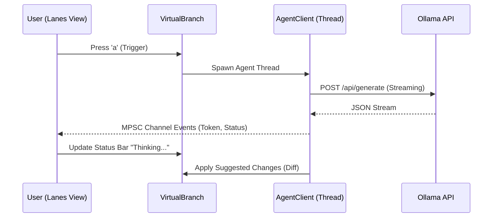

# 🤖 AI Agent Integration

**ProGit Agents** are autonomous coding assistants that work on specific virtual branches.

## Architecture

ProGit uses a **Local-First** approach for AI agents. By default, it connects to a local [Ollama](https://ollama.ai) instance to ensure your code never leaves your machine unless you explicitly configure a cloud provider.



## Setup

1. **Install Ollama**: Follow instructions at [ollama.ai](https://ollama.ai).
2. **Pull Model**:
   ```bash
   ollama pull deepseek-coder
   # or
   ollama pull codellama
   ```
3. **Run ProGit**: No extra config needed if Ollama is at `http://localhost:11434`.

## Usage

1. Open **Lanes View** (`V`).
2. Select a virtual branch (h/l to navigate).
3. Press `a` to wake up the agent.
   - The agent will analyze the hunks owned by this branch.
   - It will attempt to refactor or complete the implementation.
   - New code will appear as new hunks in the lane.

## Capabilities

| Capability | Status | Description |
|------------|--------|-------------|
| **Refactor** | ✅ Beta | Propose cleanups for existing hunks. |
| **Complete** | 🚧 Planned | Finish stubbed functions. |
| **Explain** | 🚧 Planned | Write PR descriptions based on hunks. |
| **Debug** | 🚧 Planned | Fix compilation errors in the branch. |

## Configuration

In `.project/config.kdl` (Planned):

```kdl
agent {
    provider "ollama"
    model "deepseek-coder:6.7b"
    temperature 0.7
    system_prompt "You are a senior Rust developer. Prioritize performance and safety."
}
```
