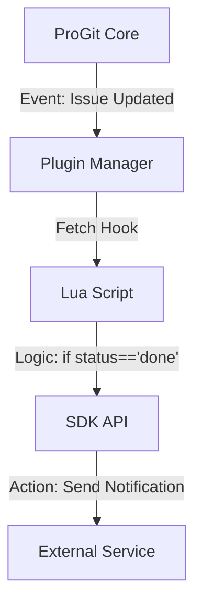

# 🛠️ ProGit SDK: The Extensibility Engine

> **"Extend the Forge without breaking the binary."**

ProGit is built for **speed and reliability** in Rust. However, every development team has unique workflows. The SDK solves the **Extensibility Paradox**: keeping the core tool lean and fast while allowing for infinite customization via plugins.

## 🌟 Why the SDK?

1.  **Zero-Recompile Extensibility**: Add custom logic (e.g., "Label this issue as 'urgent' if it contains 'CRITICAL' in the title") without rebuilding the binary.
2.  **Ecosystem Growth**: Community-built "Addons" like Jira bridges, Slack notifications, or custom TUI dashboard widgets.
3.  **Enterprise Integration**: Inject compliance checks, internal tool integrations, or custom auth flows.

---

## 🏗️ Architecture: The "Glue Layer"

The SDK acts as the safe interface between the high-performance Rust core and the user-defined extension environment.

| Layer | Technology | Role |
|-------|------------|------|
| **Core** | **Rust** | High-speed storage (`issues.json`), TUI rendering (`ratatui`), Git operations (`libgit2`). |
| **SDK** | **Rust (FFI)** | Defines hooks, context, and safe APIs for plugins to interact with the core. |
| **Plugins** | **Lua** (Current) / **WASM** (Future) | User-defined scripts for automation and integration. |

---

## 🔌 The Plugin Life-Cycle

Plugins are loaded from `.progit/plugins/` by default, with optional legacy project-local loading from `plugins/` for explicitly-scoped installs.

### Supported Hooks (The "When")
*   `init`: Setup resources.
*   `on_issue_created`: React to new tasks.
*   `on_issue_updated`: Sync changes or validate fields.
*   `on_issue_deleted`: Cleanup external references.
*   `on_mr_sync`: (Upcoming) Process merge request metadata.

---

## 🔮 Future Roadmap: The WASM Forge

While Lua is the current standard for lightweight scripting, we are moving toward **WASM (WebAssembly)** support (Target: Sprint 4). This will allow developers to write ProGit extensions in **Rust, Zig, Nim, or Go** and run them at near-native speed within the TUI.

---

## 🚀 Enterprise Idea Backlog & Advanced Use Cases

These features leverage the SDK to bring "Big Forge" capabilities to your local terminal.

### 1. CI/CD Integration (Job Token Auth)
*   **Concept**: Leverage GitLab's `CI_JOB_TOKEN` (or GitHub Actions tokens) to allow ProGit to run *inside* CI pipelines as a bot.
*   **Capabilities**:
    *   Automate issue updates based on pipeline status.
    *   Auto-label MRs based on coverage reports.
    *   Gate merges on custom compliance checks.
*   **Feasibility**: Highly feasible via SDK hooks (`on_pipeline_success`) and adding "Job Token" auth support.

### 2. GitLab Knowledge Graph (GKG) Integration
*   **Concept**: Use the SDK to query GitLab's Knowledge Graph (Code Intelligence/LSIF) via GraphQL/MCP.
*   **Value Add**: **"Local Impact Analysis"**. Before you push a commit, ProGit could warn: *"Modifying `auth.rs` will impact 15 other modules."*
*   **The "Rich Client" Model**: ProGit acts as a high-performance local client for remote code intelligence, displaying graph data side-by-side with your local diffs.
*   **AI Context**: Integration with **MCP (Model Context Protocol)** to allow local AI agents to "understand" your repository structure using GKG data.
